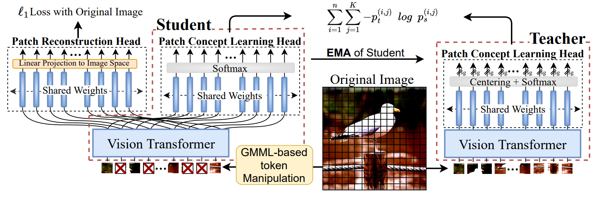
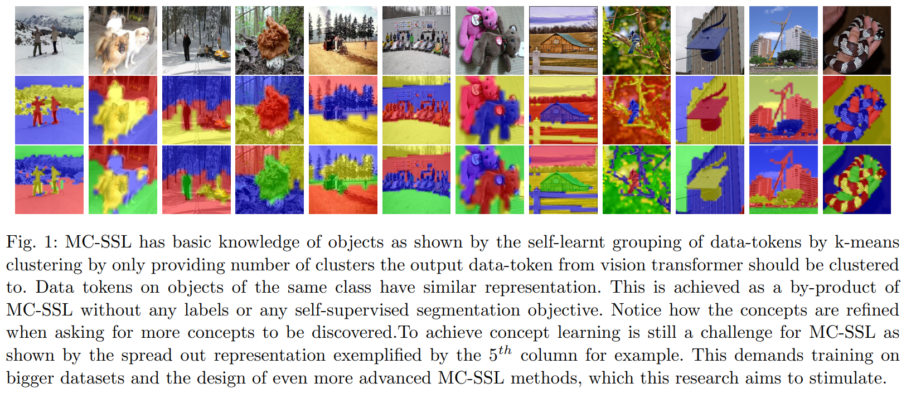

# MC-SSL: Towards Multi-Concept Self-Supervised Learning

This repository contains the official PyTorch self-supervised pretraining, finetuning, and evaluation codes for 

[MCSSL](https://arxiv.org/abs/2111.15340): Towards Multi-Concept Self-Supervised Learning.

# Main Architecture



# Visualization of Self-supervised Clustering



# Self-supervised pre-training

> python -m torch.distributed.launch --nproc_per_node=8 --use_env main_MCSSL.py --batch_size 64 --epochs 800 --data_location 'path/to/imageNet/trainingimgs' 

| Architecture  | # paramters   | Finetuning Accuracy | download |
| :-------------: | :-------------: | :-------------: |  ------------- |
| ViT-S/16 | 22M  | 82.4 % |[checkpoint](https://drive.google.com/file/d/1QIRFfKyNj0_VC7aHHQvKvuHJlD9aUxR9/view?usp=share_link) |
| ViT-B/16 | 85M  | 84.0 % |[checkpoint](https://drive.google.com/file/d/1KjblkfYAsRIlr5z6oIO5Y03-7aCcgsVm/view?usp=sharing) |

# Finetuning
We rely on the finetuning strategy of [Deit](https://github.com/facebookresearch/deit) 

# Acknowledgement

This repository is built in top of the SiT and the DINO repository.

# Citation

If you use this code for a paper, please cite:

```
@article{atito2021mc,

  title={MC-SSL0. 0: towards multi-concept self-supervised learning},

  author={Atito, Sara and Awais, Muhammad and Farooq, Ammarah and Feng, Zhenhua and Kittler, Josef},

  journal={arXiv preprint arXiv:2111.15340},

  year={2021}

}
```
